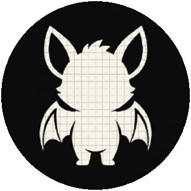

<!--
@Author: rogue-dev-studio
@Date: 2026-08-14 16:30:00
@Last Modified by: rogue-dev-studio
@Last Modified time: 2026-08-23 14:50:00
-->

  
    
  
  
  
  
  
  
   
  

# Rogue Developer

Software Engineer based in Bandung. Day-to-day work on web applications and information systems. Public work lives on the portfolio site.

## Languages and Tools:

  <strong>Languages</strong> 
  
  
  
  
  
  
  
  
  
  
  
  
  
  
  
  
  
  
  
  
  
  
  
  
    
  <strong>Frameworks &amp; UI</strong> 
  
  
  
  
  
  
  
  
  
  
  
    
  <strong>Databases</strong> 
  
  
    
  <strong>Infrastructure &amp; messaging</strong> 
  
  
  
    
  <strong>Version control &amp; collaboration</strong> 
  
  
  
  
    
  <strong>Frontend &amp; media</strong> 
  
  
  
    
  <strong>Mobile, game &amp; 3D</strong> 
  
  
  
    
  <strong>Hosting &amp; static sites</strong> 
  
  
  
    
  <strong>AI dev tools</strong> 
  
  
  

## Language velocity

  <picture>
    <source media="(prefers-color-scheme: dark)" srcset="assets/insights/metrics-velocity.svg" />
    <source media="(prefers-color-scheme: light)" srcset="assets/insights/metrics-velocity-light.svg" />
    
  </picture>

## Contribution rhythm

  <picture>
    <source media="(prefers-color-scheme: dark)" srcset="assets/insights/metrics-rhythm.svg" />
    <source media="(prefers-color-scheme: light)" srcset="assets/insights/metrics-rhythm-light.svg" />
    
  </picture>

## Contributions

  <picture>
    <source media="(prefers-color-scheme: dark)" srcset="https://raw.githubusercontent.com/rogue-dev-studio/rogue-dev-studio/output/github-contribution-grid-snake-dark.svg" />
    <source media="(prefers-color-scheme: light)" srcset="https://raw.githubusercontent.com/rogue-dev-studio/rogue-dev-studio/output/github-contribution-grid-snake.svg" />
    
  </picture>

## Relevant repositories

| Repo | Notes |
|------|-------|
| [rogue-dev-studio.github.io](https://github.com/rogue-dev-studio/rogue-dev-studio.github.io) | Portfolio website |
| [ai-agents-rogue](https://github.com/rogue-dev-studio/ai-agents-rogue) | Catalog of agents, rules, and skills |
| [porto_aplikasi_sistem_informasi_klinik](https://github.com/rogue-dev-studio/porto_aplikasi_sistem_informasi_klinik) | Clinic information system portfolio |
| [laravel-pms](https://github.com/rogue-dev-studio/laravel-pms) | Laravel 11 project-management UI demo, not a production PMS |
| [sistem-informasi-seminar](https://github.com/rogue-dev-studio/sistem-informasi-seminar) | Android (Java) login prototype, not a full seminar system |

Many other repositories on this account are coursework archives, forks, or experiments. The ones above are clearer entry points.

## Contact

[aris.hadisopiyan@gmail.com](mailto:aris.hadisopiyan@gmail.com)
